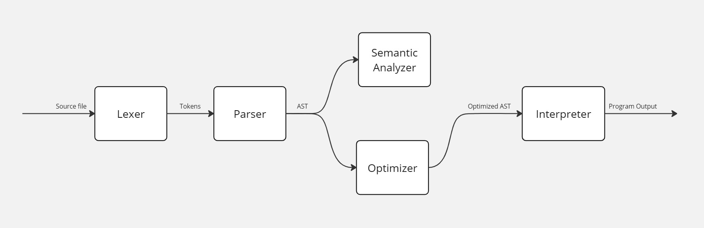

# DLang
The purpose of this project is to implement an intepretator for D language.

Team: **#FREEDUROV**
- **Daniil Tiuftin** (d.tiuftin@innopolis.university)
- **Kiril Arkhipov** (k.arkhipov@innopolis.university)
- **Evgeniy Spiridonov** (e.spiridonov@innopolis.university)

## Technology stack
- **Source language**: D
- **Implementation language**: C#
- **Lexer**: handwritten
- **Parser**: GPPG generated
- **Target**: interpretation

## Project Architecture


### Lexer
Token Recognition:
- Switch-Case Logic: \
A `switch` statement identifies single-character and multi-character tokens
- Keyword and Identifier Matching: \
Identifiers are processed using a loop to gather valid characters, then
checked against a keyword list to distinguish reserved words from
user-defined names.

Features:
- Location tracking
- Support of escape sequences in string literals

### Parser
- Generated at compile-time using GPPG

### Analyzer
- Recursively traverses the AST.
- Checks for proper keyword usage (in ex. `return` keyword should only be
used inside the function body).
- Maintains a stack to check for undeclared identifiers and identifier
redefinition while allowing variable shadowing.

### Optimizer
- Recursively traverses the AST
- For each encountered expression and subexpression checks if it is constant
and evaluates it if so. Reports errors on unsupported operations.
- Strips unreachable code (in ex. statements after `return` statement).

### Interpretator
- Recursively traverses the AST.
- Executes each statement one by one.
- Maintains a stack with namespaces (set of variables in the current scope).
- Prevents stack overflow by checking the stack size for every namespace
allocation.

## Major Data Structures
### AST
Tree representation of source code.
### Namespace
Collection of variables and their values in a specific scope.
### Stack
Collection of namespaces with interface to access variables' values.

## Feature Checklist
- [x] Lexing
  - [x] Location tracking
  - [x] Escape sequences in string literals
- [x] Parsing
- [x] Semantic analysis
  - [x] Check proper keyword usage
  - [x] Check references to undeclared identifiers
  - [x] Check identifier redefinition
- [x] Optimization
  - [x] Evaluate constant expressions
  - [x] Strip unreachable code
- [ ] Interpretation
  - [x] Variable shadowing
  - [x] Recursive functions
  - [x] Stack overflow prevention
  - [ ] Captures in higher-order functions

## Examples
### Hello World
```pascal
print "Hello World!\n";
```

Standard output: \
`Hello World!`

### Scopes and shadowing
```pascal
var x := 5;
if true then
    var x := 2;
    print x;
end
print x;
```

Standard output: \
`2` \
`5`

### Loops
```pascal
var n := readInt;
for 0..n loop
    for 0..n loop
        print "* ";
    end
    print "\n";
end
```

Standard input: \
`4` \
Standard output: \
`* * * *` \
`* * * *` \
`* * * *` \
`* * * *`

### Arrays
```pascal
var arr := [1, 2, 3, 4, 5];
print arr, "\n";
print arr[1], "\n";
print arr[5], "\n";
arr[3] := 42;
print arr, "\n"; 
```

Standard output: \
`[[1] = 1, [2] = 2, [3] = 3, [4] = 4, [5] = 5]` \
`1` \
`5` \
`[[1] = 1, [2] = 2, [3] = 42, [4] = 4, [5] = 5]`

### Tuples
```pascal
var tup := {a := 1, b := "hello world", 3.1415};
print tup, "\n";
print tup.a, "\n";
print tup.b, "\n";
print tup.3, "\n";

var tup2 := {c := 3, false};
var tup3 := tup + tup2;
print tup3, "\n";
```

Standard output: \
`{a = 1, b = hello world, 3.1415}` \
`1` \
`hello world` \
`3.1415` \
`{a = 1, b = hello world, 3.1415, c = 3, false}`

### Recursive factorial function
```pascal
var factorial := func(n) is
    if n <= 1 then
        return 1;
    end

    return n * factorial(n - 1);
end;

var n := readInt;
print factorial(n), "\n";
```

Standard input: \
`5` \
Standard output: \
`120`

### Higher-order functions
```pascal
var apply := func(f, x) => f(x);
var double := func(n) => n * 2;

print apply(double, 4), "\n";
```

Standard output: \
`8`

## Distribution of work
### Daniil Tiuftin
- Implementation of parsing
- Implementation of semantic analysis
- Implementation of AST optimizations
- Implementation of interpretation
- Implementation of additional lexing features
- Project testing
- Presentation writing
  
### Kiril Arkhipov
- Project testing
- Presentation writing

### Evgeniy Spiridonov
- Implementation of lexing
- Project testing
- Presentation writing
